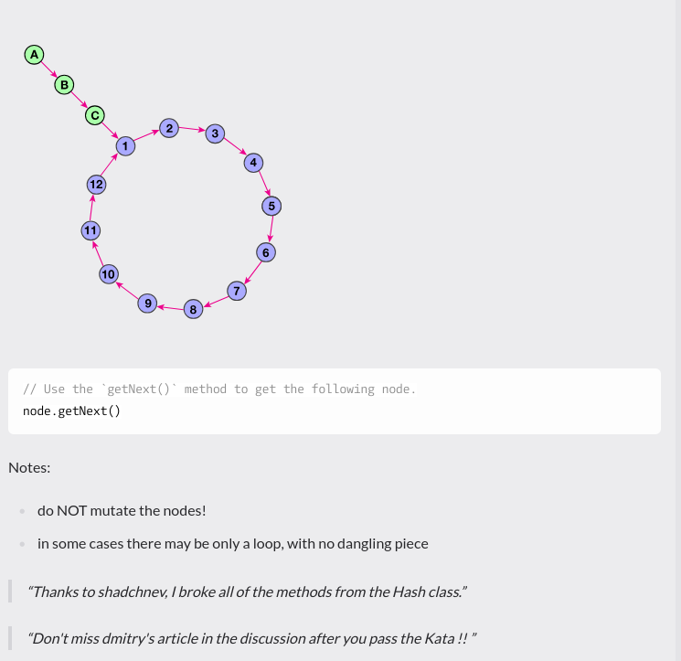

# LoopInspector

You are given a node that is the beginning of a linked list. This list contains a dangling piece and a loop. Your objective is to determine the length of the loop.

For example in the following picture the size of the dangling piece is 3 and the loop size is 12:

